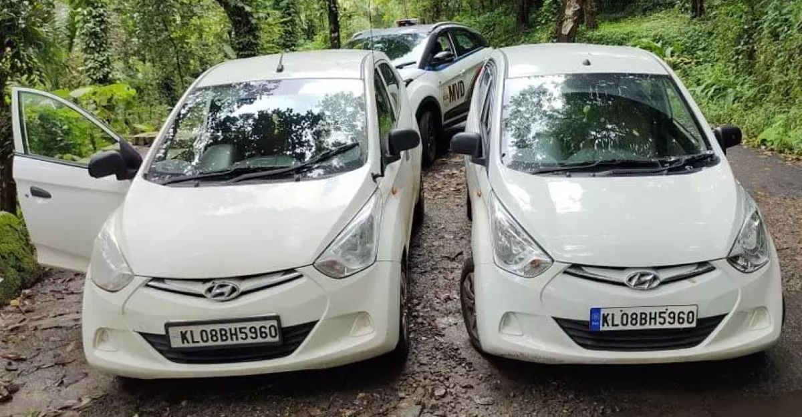
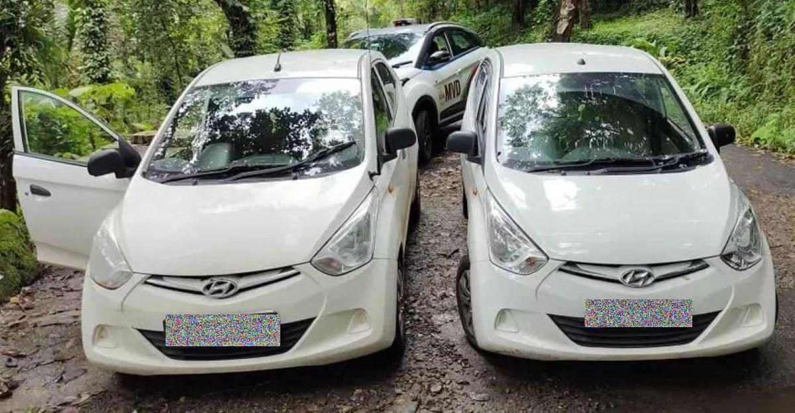
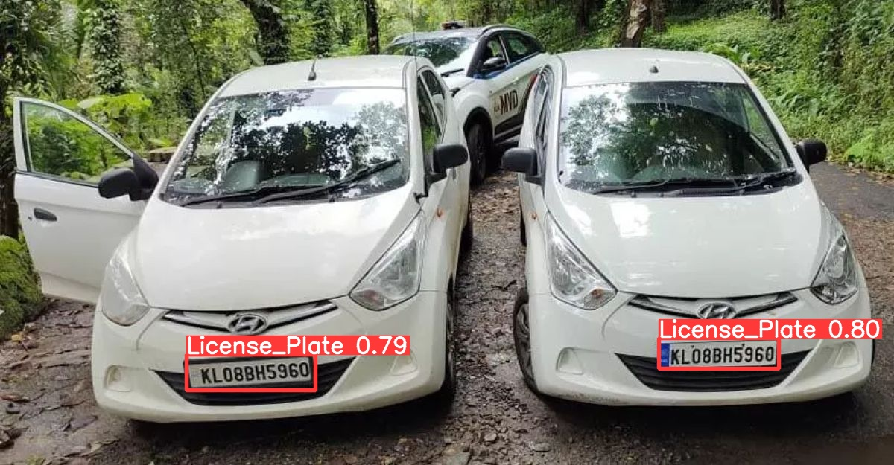

# encrypted-image-for-vehicles

A machine learning model that detects license plates/registration plate numbers in images, and then encrypts them for privacy purposes.

## Short Demonstration

### Initial image:

 

### Final image:

 

### Image Bouding Box

 

## Current Results

| Metric                       | Result  |
| ---------------------------- | ------- |
| Number of correct detections | 856     |
| Precision                    | 0.94066 |
| Recall                       | 0.94900 |
| F1 Score                     | 0.94481 |
| True Positives (TP)          | 856     |
| False Positives (FP)         | 54      |
| False Negatives (FN)         | 46      |
| Accuracy                     | 0.90020 |

## Used Dataset

Source: [Roboflow](https://universe.roboflow.com/augmented-startups/vehicle-registration-plates-trudk/dataset/1?ref=roboflow2huggingface)

Categories: YOLOv8
Classes: 1
Class Names: 'License_Plate'

## Dataset Splot

- Train set: 80% (6176 images)
- Validation set: 20% (1765 images)
- Test set: 10% (882 images)

## Dataset Preprocessing

- Auto-Orient: Applied

#### The dataset is also available in the `dataset` folder.
