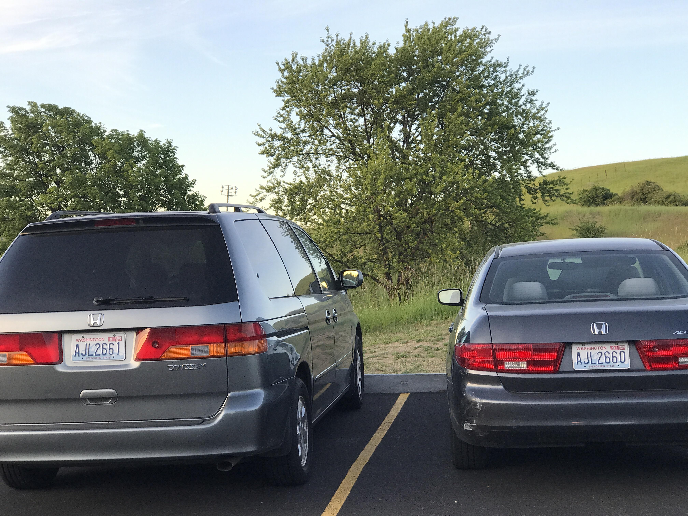
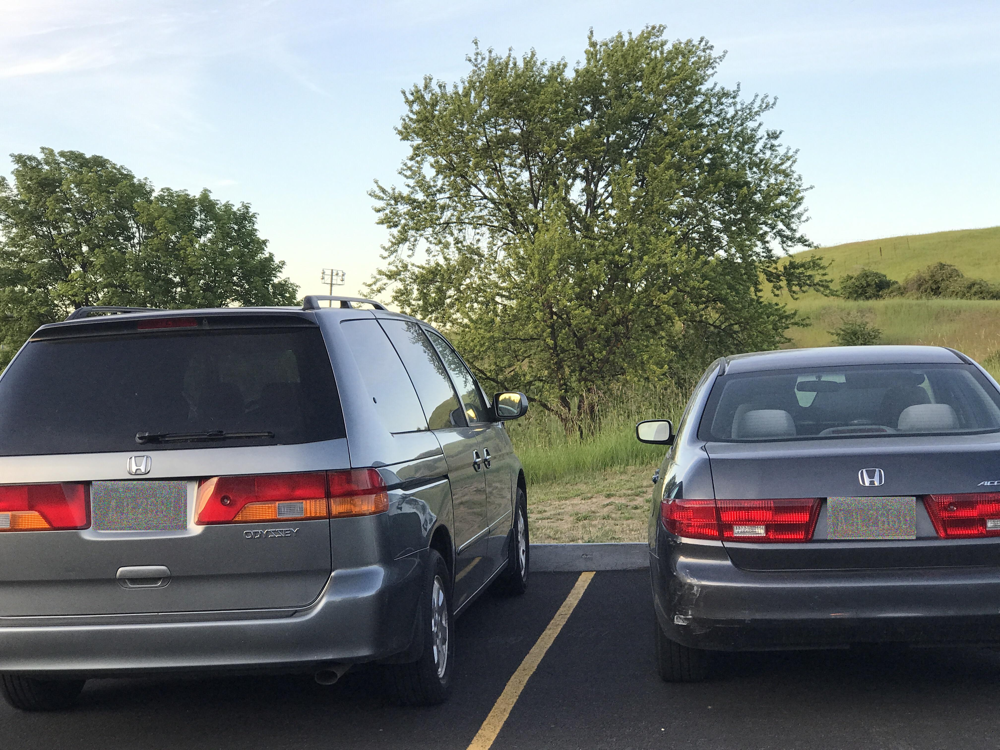
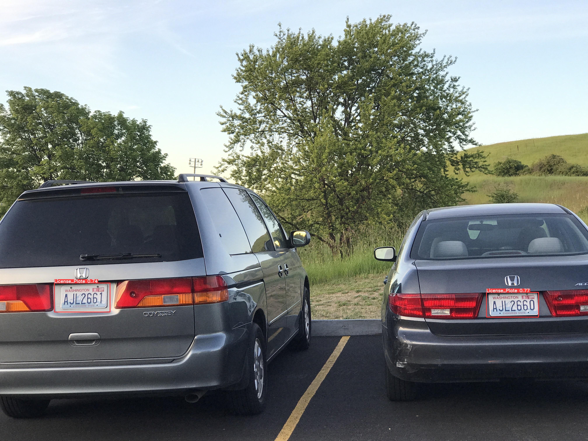

# Secured Encryption Mechanism On Vehicles’ Numberplates

A deep learning model that detects license plates/registration plate numbers in images, and then encrypts them for privacy purposes.

<!-- Use `jupyter lab --allow-root` in terminal. -->

## Short Demonstration

Our research combines YOLOv8 for precise car number plate detection with a chaotic-based logistic map encryption method. YOLOv8 ensures accurate identification of number plates in real-time, while the chaotic encryption provides robust security. The integration of these technologies offers a streamlined and secure solution for handling car number plate data, applicable in diverse domains like transportation and surveillance.

### Initial image:

 

### Final image:

 

### Image Bouding Box

 

## Complete Jupyter Notebook

### 🖱️ [Click Here](./Vehicle_Image_Encryption_Research.ipynb)

## Current Results

| Metric                       | Result |
| ---------------------------- | ------ |
| Number of correct detections | 896    |
| Precision                    | 0.98   |
| Recall                       | 0.99   |
| F1 Score                     | 0.99   |
| True Positives (TP)          | 896    |
| False Positives (FP)         | 15     |
| False Negatives (FN)         | 6      |
| Accuracy                     | 0.98   |

## Configuration Of The Local Machine

|  **Component Category**  |          **Specific model**           |
| :----------------------: | :-----------------------------------: |
|           CPU            |    Ryzen 5 3500X 6 Core, 6 Threads    |
|           RAM            |          24GB DDR4 3200 BUS           |
|           GPU            |   Nvidia GeForce RTX 3050 8GB GDDR6   |
| Compute Capability (GPU) |                  8.6                  |
|        CUDA Cores        |                 2560                  |
|           SSD            | Samsung 980 1TB PCIe 3.0 M.2 NVMe SSD |

## Used Dataset

Source: [Roboflow](https://universe.roboflow.com/augmented-startups/vehicle-registration-plates-trudk/dataset/1?ref=roboflow2huggingface)

Categories: YOLOv8  
Classes: 1  
Class Names: 'License_Plate'  

## Dataset Split

- Train set: 80% (6176 images)
- Validation set: 20% (1765 images)
- Test set: 10% (882 images)

## Dataset Preprocessing

- Auto-Orient: Applied
- Resizing: Applied (460x460)
- Zooming
- Cropping

#### The dataset is also available in the `dataset` folder.
